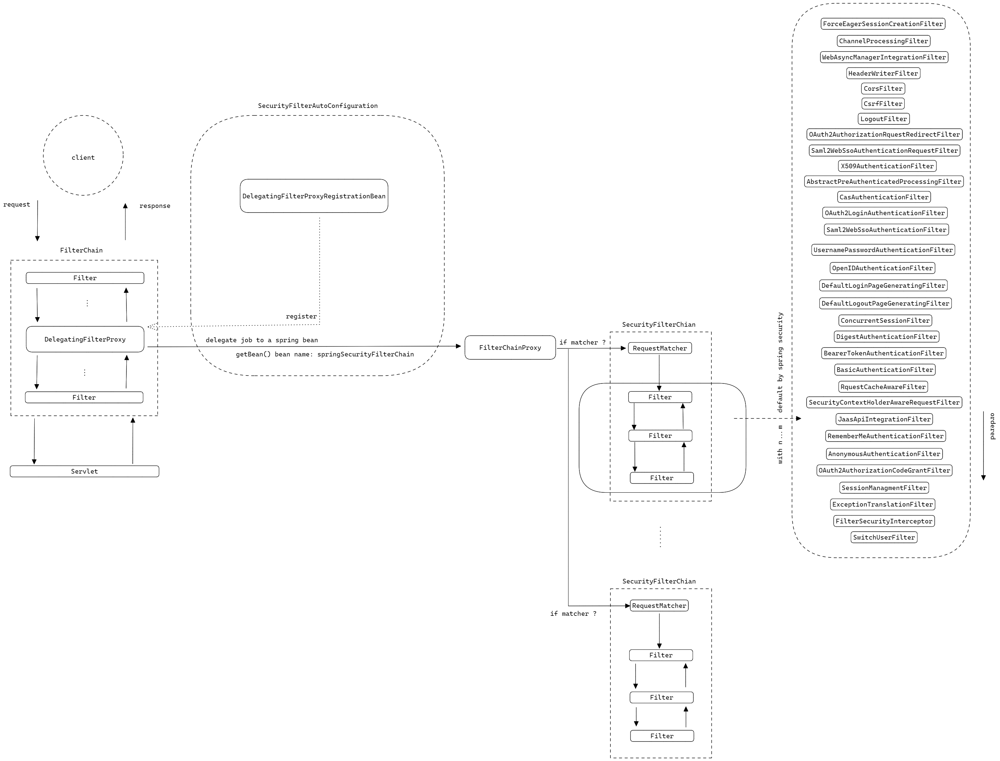
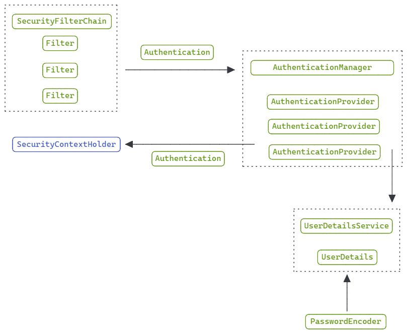
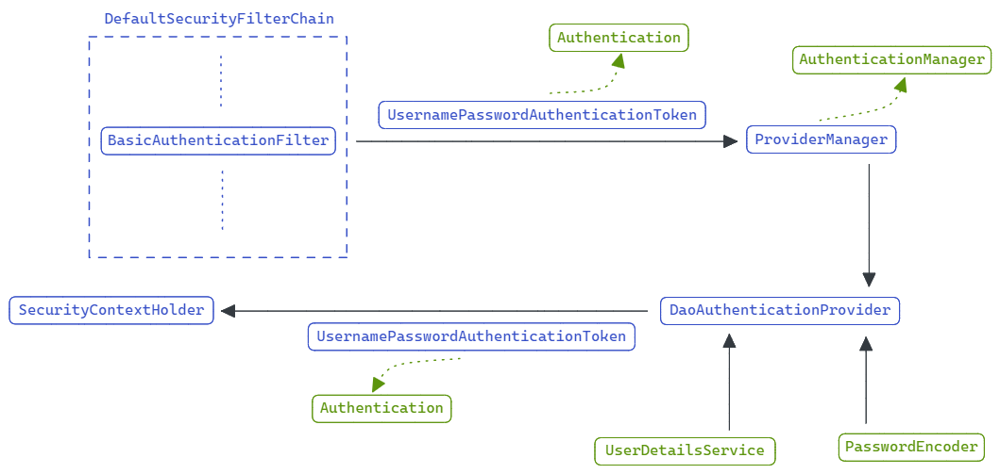
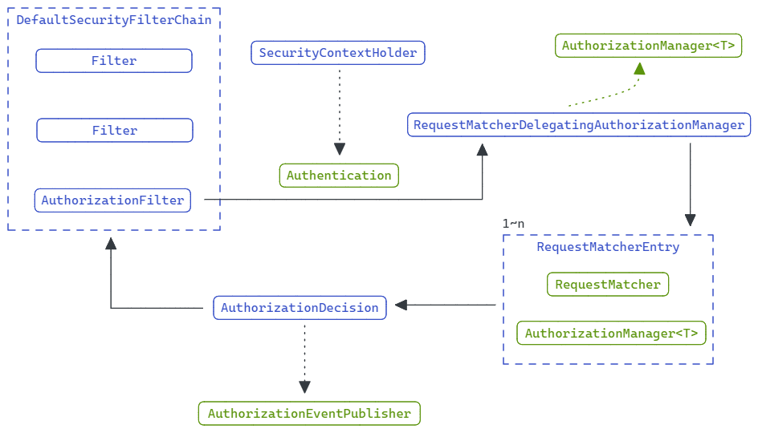
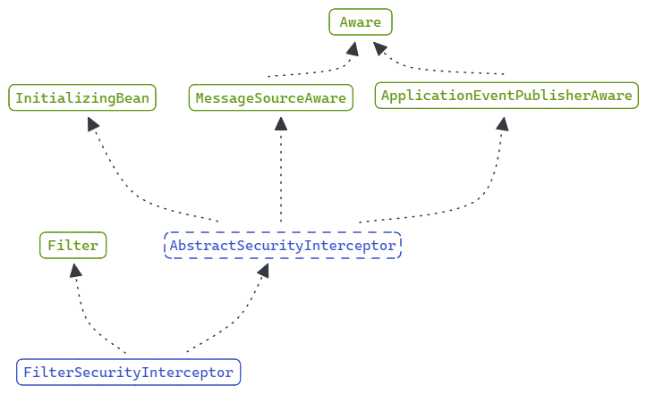
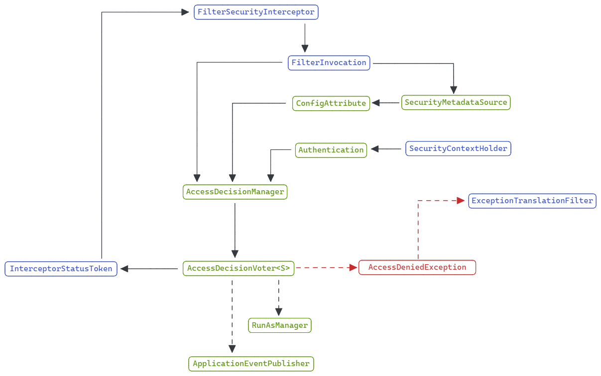
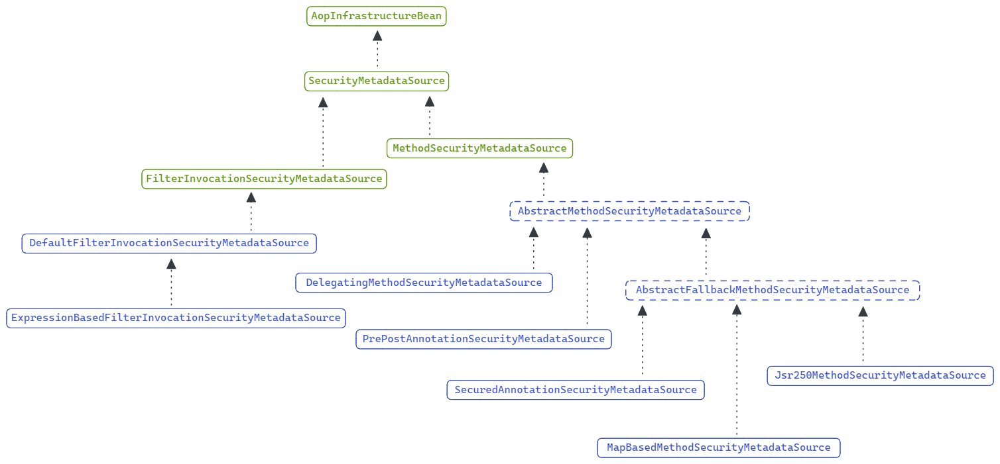
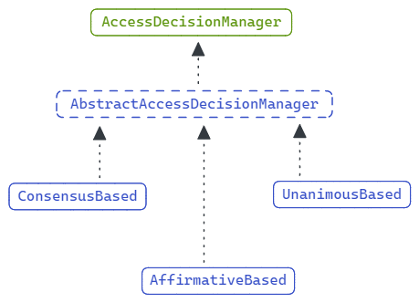
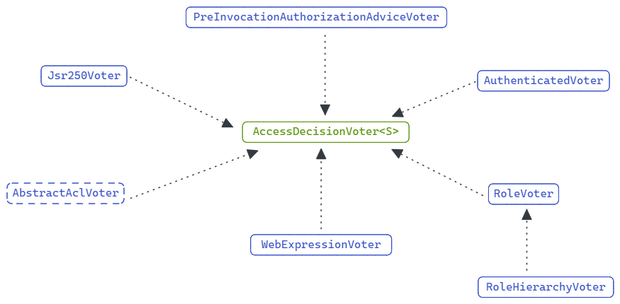

# Spring Security

spring security 是 spring 家族提供的安全框架。

它不仅提供了传统的基于账号密码的安全认证，也提供了类似于 OAuth2，OIDC 等更加高级的安全认证方式。

并且支持了 spring boot 和 spring cloud。

本文基于 spring boot **2.7.5** 总结对于 spring security 的基本认识。

spring security 为使用 spring boot 的用户提供了自动装配启动器，在 maven 项目中可以通过如下坐标引入 spring security。

```xml
<dependency>
    <groupId>org.springframework.boot</groupId>
    <artifactId>spring-boot-starter-security</artifactId>
</dependency>
```

当引入该坐标后，即使在不进行任何配置的情况下，spring security 也在我们的项目中生效了。

在项目启动时，我们将在控制台中看到如下输出。

```text
Using generated security password: 6b4ca58e-4dd4-4aea-8705-3d71af18884a

This generated password is for development use only. Your security configuration must be updated before running your application in production.
```

spring security 的自动装配为我们自动装配了一个用户，用户名为 `user`，密码为 `6b4ca58e-4dd4-4aea-8705-3d71af18884a`。

此时假设我们有一个 controller 端点如下。

```java
@GetMapping("/hello")
public String hello() {
    return "Hello!";
}
```

此时再访问 */hello* 端点将被重定向到一个页面并在登录后，被再次重定向回 */hello* 端点，从而完成访问。

# Auto Configure By Spring Boot

之所有有这种能力，是因为 spring boot 为我们提供了自动装配。通过 `spring-autoconfigure-metadata.properties` 文件列出 servlet 环境下的自动装配类如下。

> 注意：这里排除了 oauth2 的自动装配信息。
>
> 注意：老版本可以查看 `spring.factories` 文件。

- org.springframework.boot.autoconfigure.security.servlet.SecurityAutoConfiguration

- org.springframework.boot.autoconfigure.security.servlet.SecurityFilterAutoConfiguration

- org.springframework.boot.autoconfigure.security.servlet.UserDetailsServiceAutoConfiguration


之前登录的用户的就是通过 `UserDetailsServiceAutoConfiguration` 自动装配的。

下面列出几个需要重点关注的类，它们是我们配置的核心。

- org.springframework.boot.web.servlet.DelegatingFilterProxyRegistrationBean

- org.springframework.security.web.DefaultSecurityFilterChain

- org.springframework.security.web.FilterChainProxy

- org.springframework.security.config.annotation.web.builders.HttpSecurity

# Filter Architecture

spring security 的 `Filter` 架构是理解 spring security 的核心，也是安全机制生效的入口。

通过一张图进行相关说明。



> 注意：图片右侧列出了所有的 `Filter` 作为参考，它们的顺序非常重要，可以参考[官网说明](https://docs.spring.io/spring-security/reference/5.7.4/servlet/architecture.html#servlet-security-filters)，或查看 `FilterOrderRegistration` 的构造器函数。
>
> 注意：spring security 会根据用户的配置，启用或停用不同的 `Filter`。

1. `SecurityFilterAutoConfiguration` 通过自动装配机制向 `ApplicationContext` 注册一个 `DelegatingFilterProxyRegistrationBean` Bean。

2. `DelegatingFilterProxyRegistrationBean` 通过 `ServletContextInitializer` 机制向 `ServletContext` 注册一个 `DelegatingFilterProxy` Filter。

3. `DelegatingFilterProxy` 通过名称查找名为 `springSecurityFilterChain` 的 `FilterChainProxy` Bean，并将 `Filter` 的职责委派给它。

4. `WebSecurity` 会在 `FilterChainProxy` 中添加 `SecurityFilterChain`，并将 `Filter` 的职责委派给它。

5. `HttpSecurity` 会根据用户配置在 `SecurityFilterChain` 中添加不同的 `Filter` 实现，并将 `Filter` 的职责委派给它们，以此实现认证和授权。

> 注意：并不是所有 `Filter` 都是负责认证和授权的，它们各司其职，比如管理 `HttpSession`，管理 `SecurityContext`，处理异常，处理 CSRF 攻击，负责登录登出，等等。

如果想知道 spring security 具体为我们配置了哪些 `Filter`，`DelegatingFilterProxy` 的构造函数就是最好的切入口。

如果想知道 spring security 的认证和授权逻辑，`SecurityFilterChain` 中的各种 `Filter` 就是最好的切入口。

# SecurityContext Architecture

`Authentication` 负责表示用户的认证信息，包括用户名，密码，权限等相关信息。

`SecurityContext` 负责存取 `Authentication`，spring security 会将用户的认证信息保存在安全上下文中。

`SecurityContextHolder` 负责管理 `SecurityContext`。

`SecurityContextHolderStrategy` 负责 `SecurityContextHolder` 的具体管理策略，也就是说 `SecurityContextHolder` 会将具体的职责委派给 `SecurityContextHolderStrategy`。

`SecurityContextRepository` 负责存取 `SecurityContext`。

> 注意：这里比较容易混淆 `SecurityContextHolder` 和 `SecurityContextRepository` 的职责。
>
> - `SecurityContextHolder` 负责在一个请求线程中管理 `SecurityContext`。因为请求会在多个 `Filter` 之间传递，所以需要一种策略让每个 `Filter` 都能获得 `SecurityContext` 从而履行自己的职责。
>
> - `SecurityContextRepository` 负责在多个请求线程之间管理 `SecurityContext`。毕竟不能让用户每次发一个请求都重新认证一次。

# Authentication Architecture

spring security 的认证架构比较复杂，先抽象的用一张认证的主流程图进行说明，再使用 *HttpBasic* 这种比较简单的基于 **用户名密码** 的方式进行说明。

> 注意：其他比较复杂的认证方式比如 OAuth2 可以 debug 跟踪，切入点就是前文所述的那些 `Filter`，基本流程大差不差，只是核心组件上会有区别。



1. 当请求到达负责认证的 `Filter` 时，认证的工作会被委派给 `AuthenticationManager`。

2. `AuthenticationManager` 负责管理整个认证流程，基本它的唯一实现是 `ProviderManager`。

3. 因为可能存在多种不同的认证方式，所以 `AuthenticationManager` 会将认证流程委派给不同的 `AuthenticationProvider`。

4. `AuthenticationProvider` 通过 `UserDetailsService` 找到用户信息 `UserDetails`。

5. 再通过 `PasswordEncoder` 验证用户的密码是否正确。

6. 最后将用户的认证信息 `Authentication` 交给 `SecurityContextHolder` 管理。

对于 *HttpBasic* 登录方式来说。



1. `BasicAuthenticationFilter` 是 *HttpBasic* 认证方式的入口，他会从请求头中解析出用户名和密码。

2. 将用户名密码封装成用户的认证信息 `UsernamePasswordAuthenticationToken`，并将其委派给 `ProviderManager` 进行认证。

3. `ProviderManager` 找到支持对 `UsernamePasswordAuthenticationToken` 进行认证的 `AuthenticationProvider`，也就是 `DaoAuthenticationProvider`，并对其进行认证。

4. 认证成功后，`DaoAuthenticationProvider` 会封装一个新的已认证的 `UsernamePasswordAuthenticationToken` 并将其返回给 `BasicAuthenticationFilter`，并存储到 `SecurityContextHolder` 中。

# Authorization Architecture

spring security 的授权架构相对比较简单，基本是通过授权过滤器实现的。但基于不同的配置，spring security 会选择两个不同的授权过滤器。

1. org.springframework.security.web.access.intercept.FilterSecurityInterceptor

2. org.springframework.security.web.access.intercept.AuthorizationFilter

[官方网站](https://docs.spring.io/spring-security/reference/5.7.4/servlet/authorization/authorize-http-requests.html) 推荐使用 `AuthorizationFilter`，但为了保持相互兼容默认启用的还是 `FilterSecurityInterceptor`。

spring security 在 *5.5* 版本中支持了 `AuthorizationFilter`。官方给出的几点推荐理由是：

1. 使用简单的 `AuthorizationManager` API 代替了复杂了 `FilterInvocationSecurityMetadataSource` API。

2. 延迟对 `Authentication` 的查找。

3. 支持基于 Bean 的配置。

其实还有一点也很重要，就是语义上的统一。如前文所述，在认证过滤器中认证职责被委派给了 `AuthenticationManager`。授权过滤器将授权职责委派给 `AuthroizationManager` 可以更好的将认证和授权的语义统一。

## Authorize with AuthorizationFilter

`AuthorizationFilter` 的架构比较简单，这里基于一张架构图进行说明。



1. 授权过滤器 `AuthorizationFilter` 会从 `SecurityContextHolder` 中获取用户的认证信息 `Authentication`，并将授权职责委派给 `RequestMatcherDelegatingAuthorizationManager`。

2. `RequestMatcherDelegatingAuthorizationFilter` 本身是 `AuthorizationManager` 的实现，其组合了多个 `RequestMatcherEntry`。

3. `RequestMatcherEntry` 是一个包装类，组合了 `RequestMatcher` 和 `AuthorizationManager`。通过 `RequestMatcher` 检查路径是否匹配，若匹配则将具体的授权职责委派给关联的 `AuthorizationManager`。

4. `AuthorizationManager` 在授权过后，将授权结果封装为 `AuthorizationDecision` 返回给 `AuthorizationFilter`。

5. `AuthorizationFilter` 根据授权结果决定是否允许请求通过，并通过 `AuthorizationEventPublisher` 发布授权结果。

## Authorize with FilterSecurityInterceptor

`FilterSecurityInterceptor` 的执行流程并不复杂，但其涉及的相关组件较多，并且其对 `Filter` 语义的表达较弱。

首先用一张图看下 `FilterSecurityInterceptor` 的继承结构。



可以看到 `FilterSecurityInterceptor` 并不像其他安全过滤器那样是基于 `GenericFilterBean` 或 `OncePerRequestFilter` 实现，而是简单的实现了 `Filter`，并将大部分逻辑在抽象类中实现。

`FilterSecurityInterceptor` 的执行流程相对比较复杂，涉及的组件非常多，这里也基于一张图进行说明。



1. `FilterSecurityInterceptor` 会将 `ServletRequest`，`ServletResponse`，`FilterChain` 包装在 `FilterInvocation` 中。

2. `FilterSecurityInterceptor` 会从 `SecurityContextHolder` 中获取用户的 `Authentication`。

3. `SecurityMetadataSource` 根据 `FilterInvocation` 的信息解析出当前请求对应的 `ConfigAttribute` 集合。

4. 将认证的职责委派给 `AccessDecisionManager`。

5. `AccessDecisionManager` 会基于 `AccessDecisionVoter` 的投票结果决定是否给予授权。

在 `FilterSecurityInterceptor` 的处理流程之外，还要理解其中包含的几个核心组件。

### SecurityMetadataSource

`SecurityMetadataSource` 的核心任务就是从对象中解析出对应的 `ConfigAttribute`，它的继承体系如下。



在 `FilterSecurityInterceptor` 场景下，spring security 默认配置的是 `ExpressionBasedFilterInvocationSecurityMetadataSource`。

从它的命名可以知道。

1. `ExpressionBasedFilterInvocationSecurityMetadataSource` 是一个 `SecurityMetadataSource` 接口的实现。

2. `ExpressionBasedFilterInvocationSecurityMetadataSource` 接收的安全对象是 `FilterInvocation`。

3. `ExpressionBasedFilterInvocationSecurityMetadataSource` 返回的 `ConfigAttribute` 是基于表达式实现的。

从 `ExpressionBasedFilterInvocationSecurityMetadataSource` 的构造器函数可以知道它会将传入的 `ConfigAttribute`, 处理成 `WebExpressionConfigAttribute`。

### AccessDecisionManager

`AccessDecisionManager` 的核心任务是决定是否予以授权，基于不同的模式，spring security 提供了不同的实现。



根据实现的命名就可以知道具体的实现模式。

- `AffirmativeBased` 基于乐观模式：只要有一个选民投赞成票，就给予授权。

- `ConsensusBased` 基于共识模式：投赞成票的选民多则给予授权，否则拒绝授权。如果平票，则根据配置决定是否给予授权。

- `UnanimousBased` 给予一致模式：只要有一个选民偷反对票，则拒绝授权。也就是说必须全员通过。

以上3种 `AccessDecisionManager` 的实现都需要处理所有选民全部弃权的场景，spring security 默人的处理方式是拒绝授权。

spring security 默认是的选择的是 `AffirmativeBased` 模式。

### AccessDecisionVoter

`AccessDecisionVoter` 代表一个选民，其主要职责是对是否允许执行进行投票。



`ExpressionBasedFilterInvocationSecurityMetadataSource` 默认情况下会使用 `WebExpressionVoter`，该实现的执行流程较复杂，涉及 SpEL 的相关内容，这里不展开。

总的来说只要记住 `AccessDecisionManager` 会根据 `AccessDecisionVoter` 的投票结果给予授权。