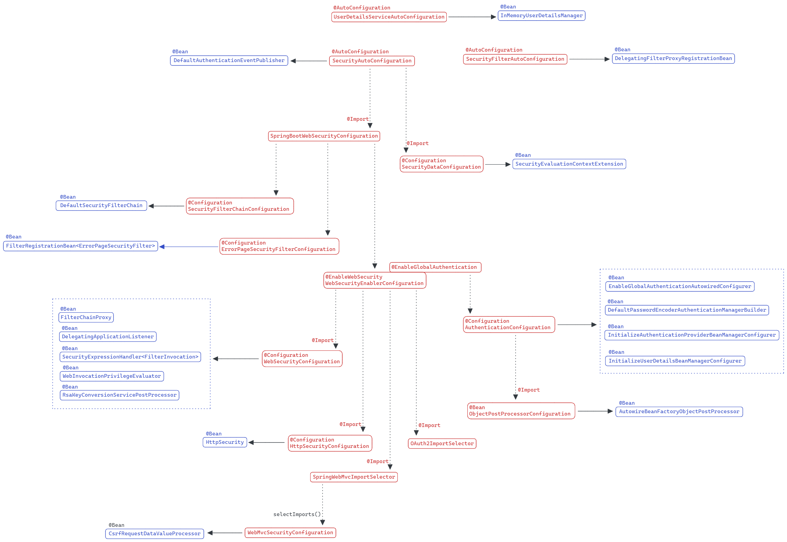
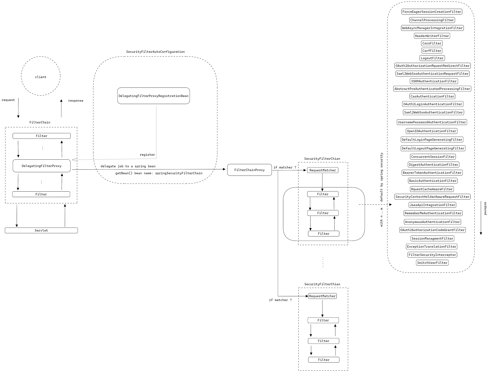

# Spring Security

spring security 是 spring 家族提供的安全框架。

它不仅提供了传统的基于账号密码的安全认证，也提供了类似于 OAuth2，OIDC 等更加高级的安全认证方式。

并且支持了 spring boot 和 spring cloud。

本文基于 spring boot **2.7.5** 总结对于 spring security 的基本认识。

spring security 为使用 spring boot 的用户提供了自动装配启动器，在 maven 项目中可以通过如下坐标引入 spring security。

```xml
<dependency>
    <groupId>org.springframework.boot</groupId>
    <artifactId>spring-boot-starter-security</artifactId>
</dependency>
```

当引入该坐标后，即使在不进行任何配置的情况下，spring security 也在我们的项目中生效了。

在项目启动时，我们将在控制台中看到如下输出。

```text
Using generated security password: 6b4ca58e-4dd4-4aea-8705-3d71af18884a

This generated password is for development use only. Your security configuration must be updated before running your application in production.
```

spring security 的自动装配为我们自动装配了一个用户，用户名为 `user`，密码为 `6b4ca58e-4dd4-4aea-8705-3d71af18884a`。

此时假设我们有一个 controller 端点如下。

```java
@GetMapping("/hello")
public String hello() {
    return "Hello!";
}
```

此时再访问 */hello* 端点将被重定向到一个页面并在登录后，被再次重定向回 */hello* 端点，从而完成访问。


# Auto Configure By Spring Boot

之所有有这种能力，是因为 spring boot 为我们提供了自动装配。通过 `spring-autoconfigure-metadata.properties` 文件列出 servlet 环境下的自动装配类如下。

> 注意：这里排除了 oauth2 的自动装配信息。
>
> 注意：老版本可以查看 `spring.factories` 文件。

- org.springframework.boot.autoconfigure.security.servlet.SecurityAutoConfiguration

- org.springframework.boot.autoconfigure.security.servlet.SecurityFilterAutoConfiguration

- org.springframework.boot.autoconfigure.security.servlet.UserDetailsServiceAutoConfiguration



之前登录的用户的就是通过 `UserDetailsServiceAutoConfiguration` 自动装配的。

下面列出几个需要重点关注的类，它们是我们配置的核心。

- org.springframework.boot.web.servlet.DelegatingFilterProxyRegistrationBean

- org.springframework.security.web.DefaultSecurityFilterChain

- org.springframework.security.web.FilterChainProxy

- org.springframework.security.config.annotation.web.builders.HttpSecurity


# Filter Architecture

spring security 的 `Filter` 架构是理解 spring security 的核心，也是安全机制生效的入口。

通过一张图进行相关说明。



> 注意：图片右侧列出了所有的 `Filter` 作为参考，它们的顺序非常重要，可以参考[官网说明](https://docs.spring.io/spring-security/reference/5.7.4/servlet/architecture.html#servlet-security-filters)，或查看 `FilterOrderRegistration` 的构造器函数。
>
> 注意：spring security 会根据用户的配置，启用或停用不同的 `Filter`。

1. `SecurityFilterAutoConfiguration` 通过自动装配机制向 `ApplicationContext` 注册一个 `DelegatingFilterProxyRegistrationBean` Bean。

2. `DelegatingFilterProxyRegistrationBean` 通过 `ServletContextInitializer` 机制向 `ServletContext` 注册一个 `DelegatingFilterProxy` Filter。

3. `DelegatingFilterProxy` 通过名称查找名为 `springSecurityFilterChain` 的 `FilterChainProxy` Bean，并将 `Filter` 的职责委派给它。

4. `WebSecurity` 会在 `FilterChainProxy` 中添加 `SecurityFilterChain`，并将 `Filter` 的职责委派给它。

5. `HttpSecurity` 会根据用户配置在 `SecurityFilterChain` 中添加不同的 `Filter` 实现，并将 `Filter` 的职责委派给它们，以此实现认证和授权。

> 注意：并不是所有 `Filter` 都是负责认证和授权的，它们各司其职，比如管理 `HttpSession`，管理 `SecurityContext`，处理异常，处理 CSRF 攻击，负责登录登出，等等。

如果想知道 spring security 具体为我们配置了哪些 `Filter`，`DelegatingFilterProxy` 的构造函数就是最好的切入口。

如果想知道 spring security 的认证和授权逻辑，`SecurityFilterChain` 中的各种 `Filter` 就是最好的切入口。


# SecurityContext Architecture

`Authentication` 负责表示用户的认证信息，包括用户名，密码，权限等相关信息。

`SecurityContext` 负责存取 `Authentication`，spring security 会将用户的认证信息保存在安全上下文中。

`SecurityContextHolder` 负责管理 `SecurityContext`。

`SecurityContextHolderStrategy` 负责 `SecurityContextHolder` 的具体管理策略，也就是说 `SecurityContextHolder` 会将具体的职责委派给 `SecurityContextHolderStrategy`。

`SecurityContextRepository` 负责存取 `SecurityContext`。

> 注意：这里比较容易混淆 `SecurityContextHolder` 和 `SecurityContextRepository` 的职责。
>
> `SecurityContextHolder` 负责在一个请求线程中管理 `SecurityContext`。因为请求会在多个 `Filter` 之间传递，所以需要一种策略让每个 `Filter` 都能顺利获得 `SecurityContext` 从而履行自己的职责。
>
> `SecurityContextRepository` 负责在多个请求线程之间管理 `SecurityContext`。毕竟不能让用户每次发一个请求都重新登录一次吧。
