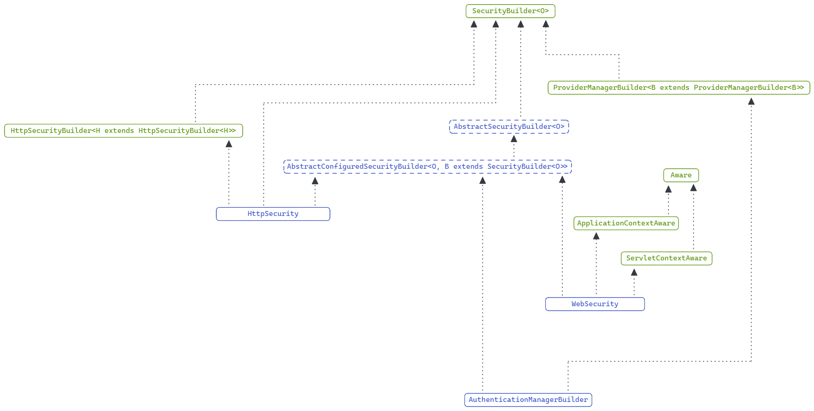

# Configuration Architecture

spring security 的配置体系较为复杂，主要涉及2个核心配置类。

- WebSecurity

- HttpSecurity

理解它们是理解 spring security 配置的关键，本文基于 spring boot **2.7.5** 进行说明。

对版本的一个简单说明：在 **spring boot 2.7.0** 之前，或 **spring security 5.7.0** 之前，一般对 spring security 的配置方式是通过继承 `WebSecurityConfigurerAdapter` 来实现的，该类既可以对 `WebSecurity` 进行配置，也可以对 `HttpSecurity` 进行配置。

但升级到 **spring boot 2.7.0** 或 **spring security 5.7.0** 之后，`WebSecurityConfigurerAdapter` 已经被标记为 `@Deprecated` 了，不推荐使用了，官方推荐直接使用 `HttpSecurity` 进行配置。

另外，`WebSecurityConfigurerAdapter` 在 **spring boot 3.0.0** 或 **spring security 6.0.0** 中被完全删除了。

# WebSecurity

`WebSecurity` 的主要职责是配置 `FilterChainProxy`，开发中一般很少直接用到 `WebSecurity`。之前在 [Filter架构](./spring-security-1-architecture.md#filter-architecture) 章节中介绍过 `FilterChainProxy`。

从 spring security **5.4.0** 版本开始，可以通过在 `ApplicationContext` 中注册 `WebSecurityCustomizer` 类型 Bean 的方式，对 `WebSecurity` 进行配置。

在 spring boot 环境中会为我们自动装配 `FilterChainProxy`，其中涉及到了 `WebSecurity` 的创建和使用的过程，可以参考 `WebSecurityConfiguration` 配置类，在之前的 [自动装配章节](./spring-security-1-architecture.md#auto-configure-by-spring-boot) 中讨论过。

# HttpSecurity

`HttpSecurity` 的主要职责是配置 `SecurityFilterChain`，这是日常开发中配置的核心。之前在 [Filter架构](./spring-security-1-architecture.md#filter-architecture) 章节中介绍的关于 spring security 默认提供的所有 `Filter` 都可以通过 `HttpSecurity` 进行配置。

从 spring security **5.4.0** 版本开始，可以通过注入的方式获得 `HttpSecurity` 的实例，然后对其进行自定义配置。

在 spring boot **2.4.0** 版本开始，或 spring security **5.4.0** 开始，会自动装配 `HttpSecurity` 类型的原型 Bean，参考 `HttpSecurityConfiguration` 配置类。虽然在 spring boot **2.4.0** 版本就已经引入了该功能，但直到 spring boot **2.7.0** 才将 `WebSecurityConfigurerAdapter` 标记为废弃，并推荐使用 `HttpSecurity` 直接进行配置。

# SecurityBuilder Architecture

无论是 `WebSecurity` 还是 `HttpSecurity`，它们都实现了 `SecurityBuilder` 接口。这里将重点讨论 `SecurityBuilder` 接口以及它的实现，该接口是整个配置架构中的核心接口。

首先通过一张图看下 `SecurityBuilder` 的继承关系。



1. `SecurityBuilder` 的核心是通过 `build()` 方法构建出一个对象，该对象通常是 spring security 架构中的一个核心组件。

    - `WebSecurity` 构建 `FilterChainProxy`。

    - `HttpSecurity` 构建 `DefaultSecurityFilterChain`。

    - `AuthenticationManagerBuilder` 构建 `ProviderManager`。

2. `AbstractConfiguredSecurityBuilder` 负责管理整个构建过程，包括构建过程的生命周期，构建过程的状态管理，以及构建目标对象需要的相关配置。

`AbstractConfiguredSecurityBuilder` 会在内部维护一个 `SecurityConfigurer` 列表，在构建前可以通过配置添加相应的 `SecurityConfigurer`。构建过程会将所有配置的 `SecurityConfigurer` 应用到对目标对象的构建中，从而实现对需要构建的目标进行配置。

在开发过程中，该配置流程通常发生在对 `HttpSecurity` 进行自定义时。可以说对 `HttpSecurity` 的每个配置选项，都有一个相应的 `SecurityConfigurer` 与之对应。它们会在最终构建 `DefaultSecurityFilterChain` 时，决定使用哪些 `Filter`，以及 `Filter` 的相关行为。

拿一个简单的例子来说。

```java
@Bean
public SecurityFilterChain securityFilterChain(HttpSecurity httpSecurity) throws Exception {
    return httpSecurity
            .httpBasic(Customizer.withDefaults())
            .build();
}
```

以上代码实际上是在 `HttpSecurity` 中添加了一个 `HttpBasicConfigurer`。并在构建对象时，将其自身的配置应用到 `HttpSecurity` 中，最终在 `DefaultSecurityFilterChain` 中配置了一个 `BasicAuthenticationFilter`。

# SecurityConfigurer Architecture
